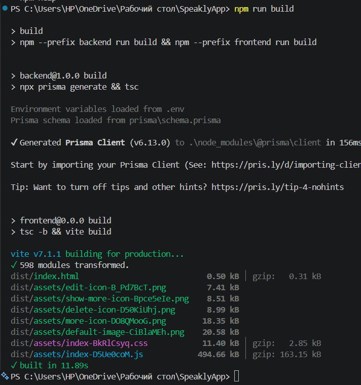
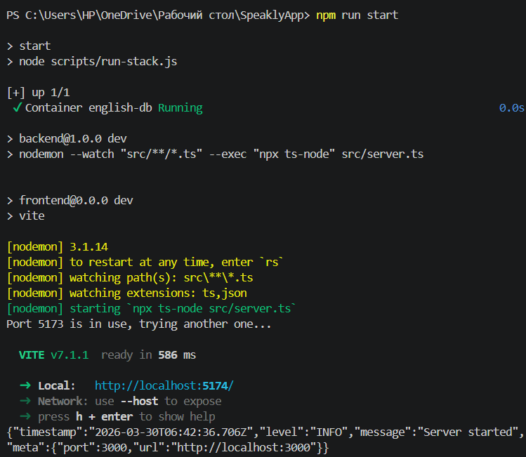
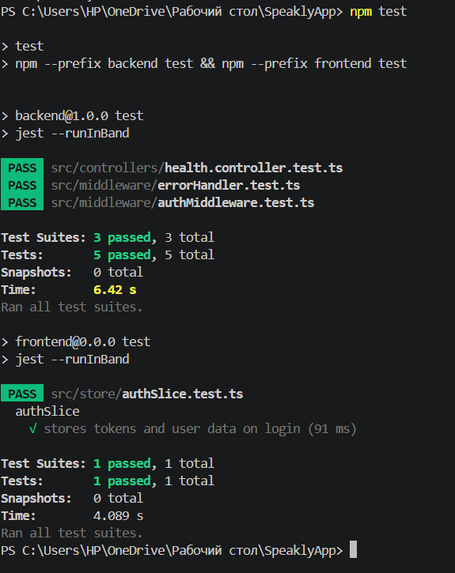
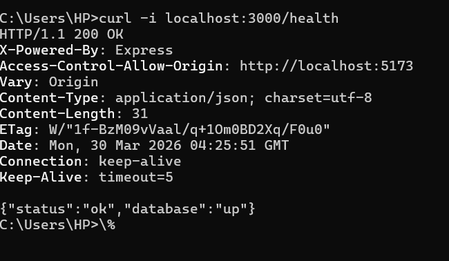
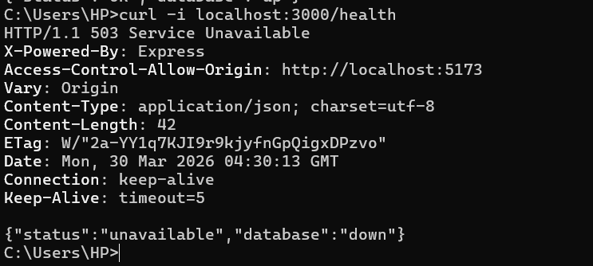
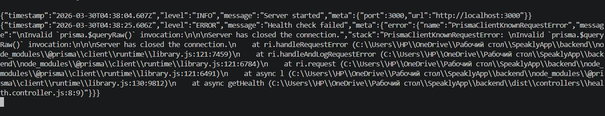
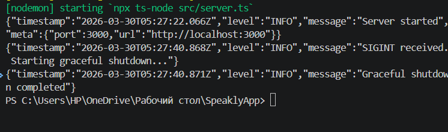

# Лабораторна робота №0: Readiness & Standardization

## Пункти лабораторної №0

## Пункт 1. Налаштування

### Backend environment variables

```env
PORT=3000
FRONTEND_ORIGIN=http://localhost:5173
DB_HOST=localhost
DB_PORT=5432
DB_NAME=english_app
DB_USER=admin
DB_PASSWORD=admin
JWT_SECRET=your_access_secret
JWT_REFRESH_SECRET=your_refresh_secret
```

### Frontend environment variables

```env
VITE_API_BASE_URL=http://localhost:3000/
VITE_BACKEND_ASSET_URL=http://localhost:3000
```

## Пункт 2. One-Command Commands

### Build

Команда для збірки всього проєкту:

```bash
npm run build
```

Скріншот:



### Start in development mode

Команда для запуску всього застосунку в режимі розробки:

```bash
npm start
```

Скріншот:



### Run tests

Команда для запуску всіх тестів:

```bash
npm test
```

Скріншот:



## Пункт 3. Підтвердження Health Check

### 3.1 Health check when database is available

Команда:

```bash
curl -i localhost:3000/health
```

Скріншот:



### 3.2 Health check when database is unavailable

Зупиніть PostgreSQL вручну, після цього виконайте:

```bash
curl -i localhost:3000/health
```

Скріншот:



## Пункт 4. Приклад JSON-логів

Кілька рядків логів, отриманих під час запуску застосунку:

```json
{"timestamp":"2026-03-29T18:00:00.000Z","level":"INFO","message":"Server started","meta":{"port":3000,"url":"http://localhost:3000"}}
{"timestamp":"2026-03-29T18:00:10.000Z","level":"ERROR","message":"Health check failed","meta":{"error":{"name":"Error","message":"DB down"}}}
{"timestamp":"2026-03-29T18:00:20.000Z","level":"INFO","message":"SIGTERM received. Starting graceful shutdown..."}
{"timestamp":"2026-03-29T18:00:21.000Z","level":"INFO","message":"Graceful shutdown completed"}
```

Скріншот:




## Пункт 5. Підтвердження Graceful Shutdown

Приклад команди:

```bash
kill <pid>
```

Скріншот:



Очікувані рядки логів:

```text
SIGTERM received. Starting graceful shutdown...
Graceful shutdown completed
```

## Пункт 6. Notes

- Health endpoint у цьому проєкті: `GET /health`
- Застосунок повертає `200 OK` лише тоді, коли доступні і сам застосунок, і база даних
- Застосунок повертає `503 Service Unavailable`, коли застосунок працює, але база даних недоступна
- Міграції бази даних застосовуються автоматично під час запуску backend через Prisma
